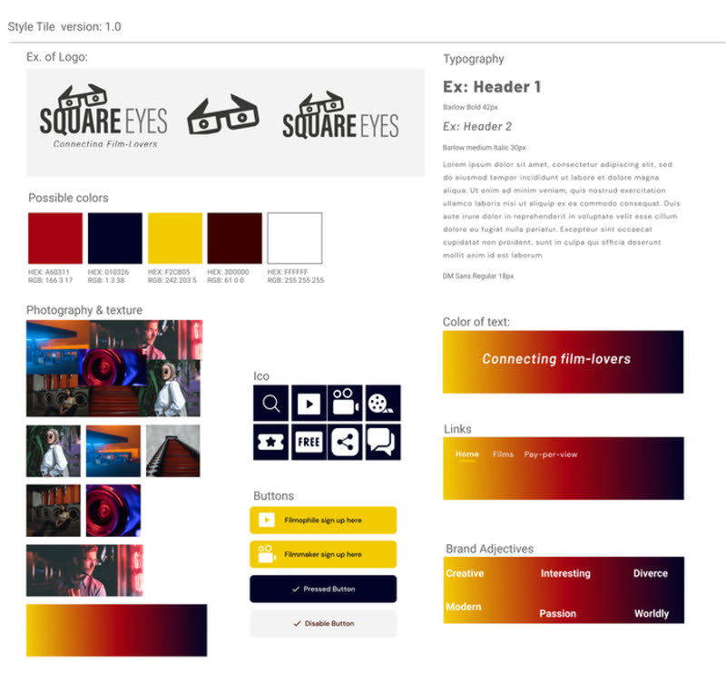

# SquareEyes

One of my school projects during Front-end Development (21-23), Noroff Oslo.

## Design:
In design, I made my first Style tile and Prototype after what we'd learned about colours, typography and hierarchy.
We used Figma for wireframing, PhotoPea.com for photo editing and Color.Adobe.com for contrast checking.  

## HTML/CSS:

## Interaction Design:
For course assignment I 